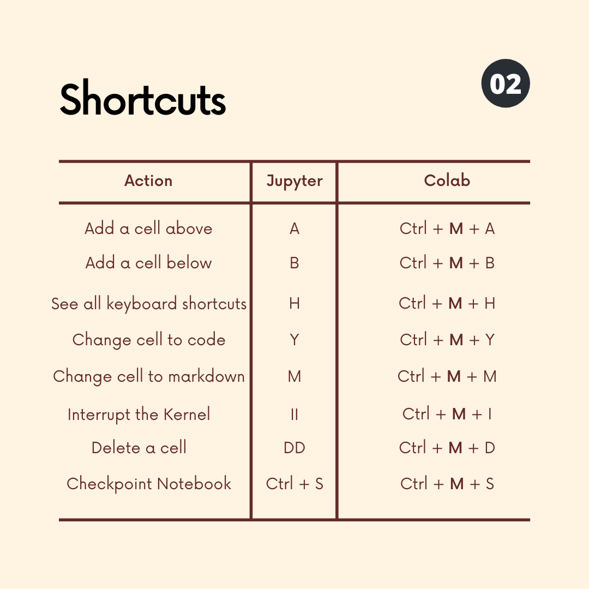

# Part 2: Managing Colab Data & Using Pandas Dataframes

## --------Google Portion--------

Cells run one at a time. It is a natural way to splice up a program.

This has several advantages for data analytics and some disadvantages.
#### Advantages:
1. You can manipulate and check data one step at a time to see how the information changes.
2. You can save data in one cell and access it in another so the whole program does not need to be rerun.
3. You can display visuals in different cells and change them ad hoc.
4. Debugging is at the cell level so it can be easier to trace the issues.
5. etc.

#### Disadvantages:
1. Cells must be run each time you open the notebook and it is easy to run all if you need packages or functions.
2. You need to make sure that all the cells are the right type and program flows need to be more heavily organized.

Additionally, most notebooks do not have good auto-complete or other quality of life IDE featueres.

Below is a list of the most commonly used shortcuts for google colab and Jupyter Labs/Notebook

Accessing Data in Google Colab:

## --------Python Portion--------

__Viewing the Data:__
 
df.head(5) # the default is 10
 
df.tail(5) # the default is 10

 Viewing Column Names:
df.columns

__Getting Specific Columns:__
 
NOTE: python is case sensitive. 
 
df['col1'] # we put the column name as a string in if its just one column we want
 
df[['col1', 'col2']] # we put multiple columns as strings in a list of strings

__Indexing:__
 
df.set_index('col1') # makes the first column the new index
 
df.set_index(['col1', 'col2']) # makes the first two columns the new index
 
df.reset_index() # this resets the index to just be numbers 0 through n

__Getting (subsetting) Rows by conditions:__
 
df[df['col1'] == 10] # gets only the rows where col1 is 10
 
df[(df['col1'] != 10) & (df['col2'] >= 3)] # rows where col1 is not 10 AND column 2 is greater than or equal to 3

__Getting (subsetting) Rows by location:__
 
df.iloc[0:3] # this gives rows 0, 1, and 2
 
df.iloc[0:3, 0:2] # this gives the first 3 rows of the first 2 columns 

__Making New columns:__
 
val3 = an array of values the length of our dataframe
 
df['col3'] = val3 # This makes a new column called 'col3' with the same values as val3
 
___NOTE-___ all column names need to be distinct. You will overwrite a column if you call its name like shown above, it will not give an error.

__Making Columns from other Columns:__
 
df['col4'] = df['col1']/df['col2'] # This makes a new column whose values are the quotient of the others
 
df['col5'] = df[['col1', 'col2']].max(axis = 1) # This makes a new column that is the max of the other two
 
___NOTE-___ there are multiple axes in these dataframes and some commands need to you specify which one you are referencing. In pandas axis = 0 is the rows/indexes and axis = 1 is the columns

__Checking Datatypes:__
 
df['col1'].dtypes

__Getting Summary Stastics:__
 
df.describe()

__Getting Counts of Categories:__
 
df.value_counts()

__Dealing with NA's:__
 
df.fillna(0) # Fills all NA values with 0
 
df['col1'].fillna(mean(df['col1']) # Fills all col1 NA values with its mean

__Grouping Data:__
 
df.groupby(by = ['col1'], dropna = False).sum() # This group sums by column 1 and if there is missing value it will be a group called "NaN" 
 
df.groupby(by = ['col2']).mean() # This groups by column 2 and uses the means of other variables for the grouping, it defaults to dropping the "NaN" group
 
data.groupby(by = ['col3'], as_index=False).agg({"col4": "sum"}) # This grouping does not index the dataframe and it uses a dictionay of column name : aggregation type to generate the aggregates

__Joining Data:__
 
pd.merge(df, df1, on = 'col1', how = 'inner') # This inner joins df and df1 on col1
 
pd.merge(df, df1, how = 'left', left_on=['col1', 'col2'], right_on=['col3', 'col4']) # This should join on col1 = col3 and col2 = col4

