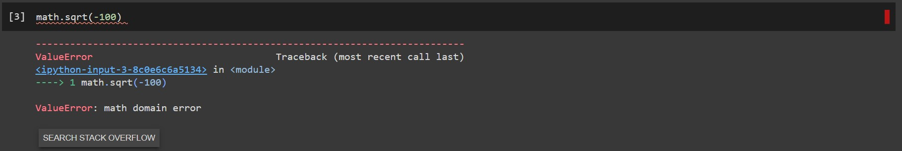
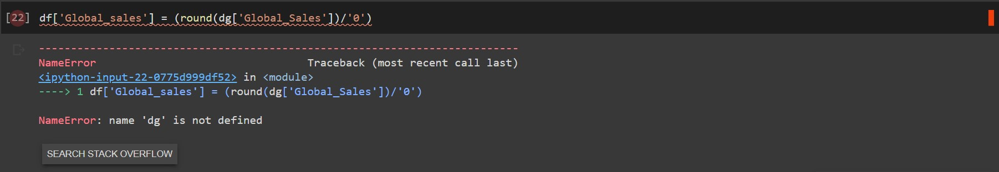
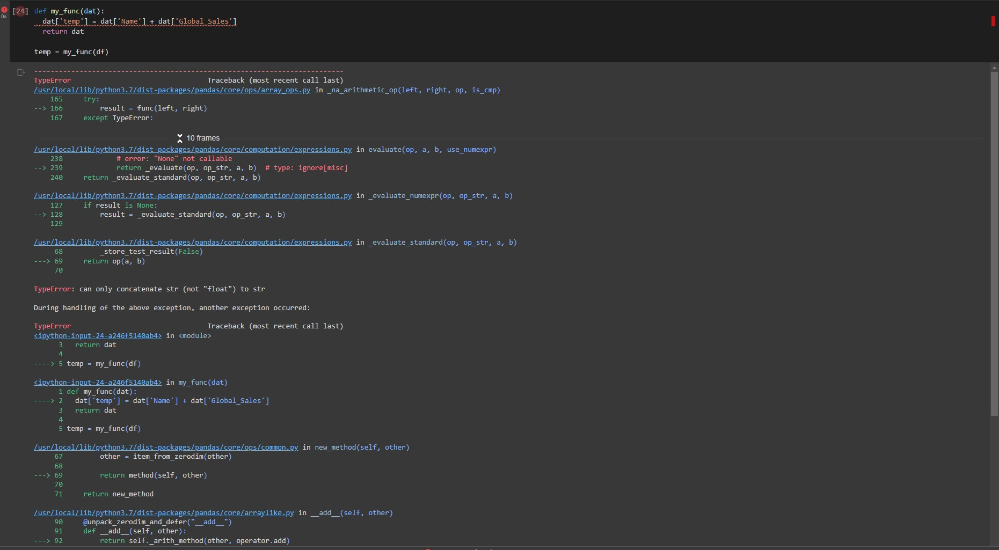

# Part 4: Debugging

## Common Error Types:

### 1. Attribute Error
MEANING: 
 
This happens when assigning a value, or attribute reference, fails. This can also happen from a misspelling 
 
EX: 
 
df['NA_sales'].str.strip()
 
This failed because the NA_sales column is an int column and a string command was called on it. The Int column has no "attribute" called str. 

### 2. Index Error
MEANING: 
 
This happens when you are trying to reference a part of data that invalid or out of bounds. Like calling the 10th value in an array of only 5.
 
EX: 
 
check = df['EU_sales'].unique()
 
This outputs the value at 'EU_sales' in the array.
 
check['EU_sales']
 
There is no 'EU_sales' index in the array so it gives an index error as the index is invalid. 

### 3. Type Error
MEANING: 
 
This happens when an operation is called on a type that doesn't support the operation. It could happen on a df column or adding an int and a string.
 
EX: 
 
df['sales'] = df['EU_sales'].astype(str)
 
df['sales_plus'] = df['sales'] + 1
 
We made sales into a string and then tried to add an integer to it. Those two types can't be combined with the '+' operator so it gives a type error

### 4. Syntax Error
MEANING:
 
This happens when you incorrectly specify a command. This could be like forgetting a colon in a conditional or in a function
 
EX: 
 
def broken_func()
 
&emsp;  print('This is working')

### 5. Name Error
MEANING:
 
This happens when you call a variable that does not exist.
 
EX:
 
print(unassigned_name)
unassinged_name was never defined which is making it error out

### 6. Zero Division Error
MEANING:
 
This happens when you divide a value by zero. NOTE: dataframes will let you divide by zero and then set the value to inf (which is a float datatype)
 
EX: 
 
10/0

___NOTE-___
 
df['EU_sales_0'] = (round(df['EU_sales']).astype(int))/0
 
Does not error out eventhough we made EU_sales an integer and divided by zero. Although, it makes the vales all floats with 'inf' values. 

### 7. Value Error 
MEANING:
 
An operation is being done on the right datatype but the command is impossible to do.
 
EX:
 
math.sqrt(-100)
 
Value Error comes from trying to take the square root of a negative number (this can't be done in the reals)

## ----- TRACING ERRORS -----

Different programs display error different by I will use Google Colab as my example. On colab when you get an error there is a plus button, this will
allow you to see where the error occured. Then within that box you can scroll down to see where all the errors are.
 
When I debug I look for the first snippet of my code in the message and then look below it until I find the spot where a problem happened.
 
EX: 
 
math.sqrt(-100) 
 

#### Debugging Message:

---------------------------------------------------------------------------

---------------------------------------------------------------------------

#### Interpretation: 

 
We can see from the error that the problem occured at math.sqrt(-100).
 
Although, it is not always this straightforward. 

 
A name error is very common, it happens when you call something that hasn't yet been defined, or more commonly in my
case you make a typo.

df['Global_sales'] = (round(dg['Global_Sales'])/'0')

#### Debugging Message:

---------------------------------------------------------------------------

---------------------------------------------------------------------------

#### Interpretation: 
We can see where it says 'dg' is not defined, so we know exactly what it is that we misnamed and can address it. In
this case the bottom most message gives us the information we need to diagnose the issue. Although its not always so 
straightforward.

#### ONE MORE COMPLICATED EXAMPLE:
 
def my_func(dat):
 
&emsp;  dat['temp'] = dat['Name'] + dat['Global_Sales']
 
&emsp;  return dat
 
temp = my_func(df)

This will error out because in the function we are adding numeric and string columns

#### Debugging Message:

---------------------------------------------------------------------------

---------------------------------------------------------------------------

#### Interpretation: 

This error message is much longer and more complicated than the others. In fact I could not fit the whole message on
my monitor. So how do we deal with so much information? Well the top of the error message tells us what the main problem
is. In this case it is a TypeError. So we have 2 types interacting in a way that makes the compilor call the code cops. 
There is a lot of code that is flagged and you can see the url has a python packaged name and url, in this case
for pandas. It is technically possible that the error is from pandas, but highly unlikely. So lets move on and not look
too deeply into the base python/pandas codes. Instead we want to find the parts that contain code we wrote, and 
in this case have an ipython url start. We see this portion starts by putting an arrow at my_func, so we know the
error happened in that function (the last function call in a chain will be the culprit) and then within that
function we can see the error is when we add the two columns. We know it is a type error so we check the types of those
columns and see that one is an integer and the other is a string columnm, which is the cause of our bug. We address that
and then move on. 

## ----- Trouble Shooting Tips -----
1. Figure out what the error message could mean. 
2. Figure out where the error happened. 
3. Figure out what package had the command that broke it. 
3. Think about what in the data or code could have caused it. 
4. If you can't figure it out, try google. Stack Overflow is the best resource, probably better than the actual pandas/python/pyspark/numpy manuals. 
5. Correct what is wrong.

