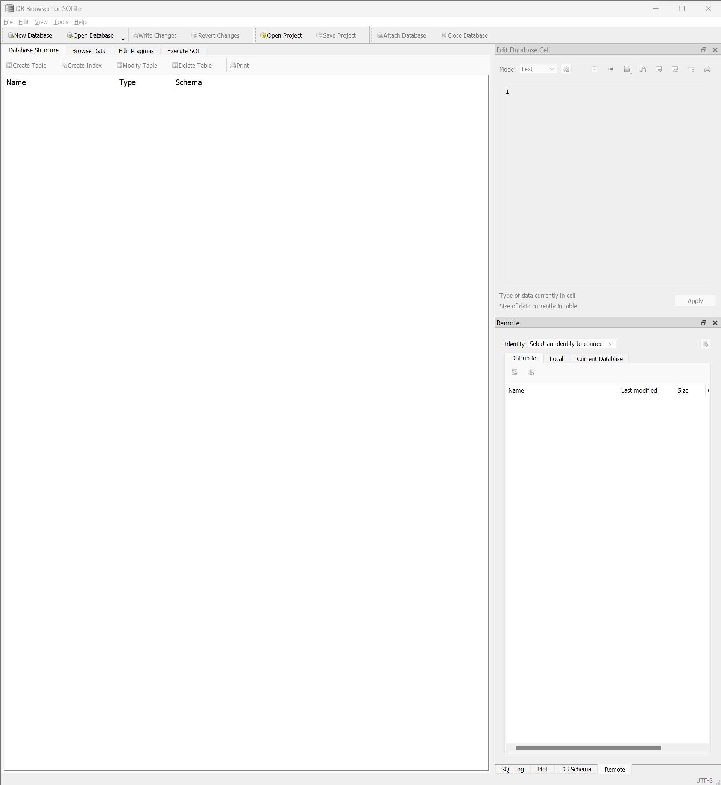
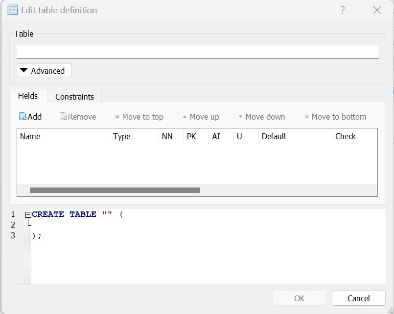

# Part 8: Anaconda

## --- Anaconda and SQL ---

### What is Anaconda?

This is a program that uses a set of python packages and programs to run them. It is geared towards data science
and data analytics. It will come with a version of python installed along with a number of other common packages.
For the sake of these lessons I will not go into using the anaconda system in depth. Although, here is a resource 
to use if you want to download more packages or use various environments: 

https://docs.anaconda.com/navigator/tutorials/manage-packages/

https://docs.anaconda.com/navigator/tutorials/use-multiple-python-versions/

I use the CMD prompt to do all of that, but these days I don't think knowing that syntax is generally necessary. If
there are more resources wanted or help for environment or package management I am happy to help in person. Beyond this
Anaconda comes with a number of programs, one of which we will be utilizing. 

The main program for our purposes is JupyterLab. It is similar to google colab which we have been using up to this point.
It is the default most common python program for analytics. There are a number of other options that can be used depending
on your needs. PyCharm community is great for any pure python developement. Often times programs may be started in notebooks
and then moved into full on .py files. I will not go over using PyCharm, but I do suggest it for developement. None
of the other programs are applicable here. Oracle has a cloud infrastructure, Spyder is another IDE that come of 
my collegues have used. I am not personally familiar with the program. But all of these and more are available through
the Anaconda Navigator. 

### How to install Anaconda

Installing Anaconda should be straight forward.

Go to https://www.anaconda.com/ and click the download button.

Follow all the steps, default settings should be fine since we are not doing anything that should require otherwise.

The Anaconda Navigator is the suite that allows access to all of the programs, otherwise you can run them straight
from the Anaconda CMD if desired.

## --- Setting Up Databases---

In order to learn to interface SQL with python we will need a database to access. So we will make our own. I will 
walk through setting one up.

Luckily SQLite is already installed as part of downloading Anaconda, so that is not an issue. That being said what we
do need is an interface to manage it with. This website will provide us with what we need: https://sqlitebrowser.org/

Install the program and then open it. 

Next, click "New Database" in the top left corner. Choose the appropriate file path and name for the database.

From here we can add tables and make our db. The console will look like this:

I apologize, I removed the rest of this lesson and have not yet rewritten it. The original had proprietary data I do
not own and cannot upload it online so I am cutting it short here. 

There is a tutorial on SQLAlchemy her: https://docs.sqlalchemy.org/en/14/tutorial/

Here is another option using pandas and an SQL Connector: https://www.freecodecamp.org/news/connect-python-with-sql/

